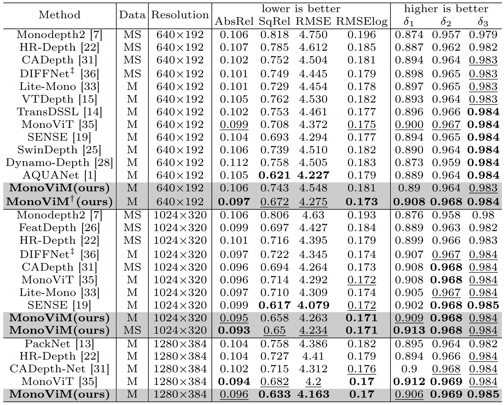
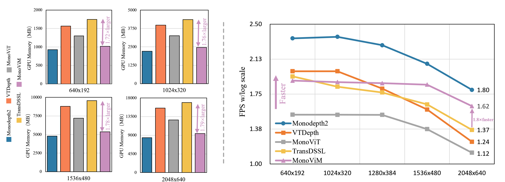

# MonoViM
An Enhancing Self-supervised Monocular Depth Estimation via Mamba.\
\

## 📈 Result

## 📥 Installation
### Step 1. Clone MonoViM repository
~~~
git clone https://github.com/aifeixingdelv/MonoViM.git
cd MonoViM
~~~
### Step 2. Environment Setup:
**Create and activate a new conda environment**
~~~
conda create -n MonoViM
conda activate MonoViM
~~~
**Install Dependencies**
~~~
pip install -r requirements.txt
cd networks/selective_scan && pip install .
~~~
## 🧩 Datasets Preparation
### 1. KITTI Dataset

**Data Download：** \
You can download the entire [raw KITTI dataset](https://www.cvlibs.net/datasets/kitti/raw_data.php) by running:
~~~
wget -i splits/kitti/kitti_archives_to_download.txt -P path_to_save_kitti
~~~
Then unzip with:
~~~
cd kitti_data
unzip "*.zip"
cd ..
~~~
You can place the KITTI dataset wherever you like and point towards it with the --data_path flag during training and evaluation.

**Splits:**\
The train/test/validation splits are defined in the splits/kitti folder. By default, the code will train a depth model using Zhou's subset of the standard Eigen split of KITTI, which is designed for monocular training. You can also train a model using the new benchmark split or the odometry split by setting the --split flag.

**Export gt depth:**
~~~
python export_gt_depth.py --data_path path_to_save_kitti  --split splits_selected
~~~
When evaluating the model, you need to export the gt depth of test images. You can select the split to export by setting the --split flag.
### 2. CityScapes Dataset
**For [CityScapes](https://www.cityscapes-dataset.com/), You should download and unzip the following packages:**\
(1) leftImg8bit_sequence_trainvaltest.zip \
(2) camera_trainvaltest.zip 

**Then preprocess data by running the following command:**
~~~
python prepare_cityscapes.py \
    --img_height 512 \
    --img_width 1024 \
    --dataset_dir raw_dataset_saved \
    --dump_root preprocessed_data_to_save \
    --seq_length 3 \
    --num_threads 24
~~~
You must set --dataset_dir and --dump_root flags according to your own raw_data_path and preprocessed_data_path.
### 3. Make3D Dataset
For [Make3D](http://make3d.cs.cornell.edu/data.html#make3d), you only need to download and unzip [Test134.tar.gz](http://www.cs.cornell.edu/~asaxena/learningdepth/Test134.tar.gz) and [Test134Depth.tar.gz](http://www.cs.cornell.edu/~asaxena/learningdepth/Test134Depth.tar.gz) from Dataset-1.

## ⏩️ Training
**KITTI Training:**\
You can add --use_stereo flag in *.txt to perform Mono+Stereo training.
~~~
# 640x192 Resolution
python train.py --args_file args/args_monovim_kitti_640x192_train.txt

# 1024x320 Resolution
python train.py --args_file args/args_monovim_kitti_1024x320_train.txt\

# 1280x384 Resolution
python train.py --args_file args/args_monovim_kitti_1280x384_train.txt
~~~
**CityScapes Finetune:**
~~~
python train.py --args_file args/args_monovim_cityscapes_416x128_finetune.txt
~~~
**Notably:** all the flags in *.txt can be found in options.py.
## 📊 Evaluation
**KITTI Evaluation:**
~~~
# 640x192 Resolution
python train.py --args_file args/args_monovim_kitti_640x192_eval.txt

# 1024x320 Resolution
python train.py --args_file args/args_monovim_kitti_1024x320_eval.txt

# 1280x384 Resolution
python train.py --args_file args/args_monovim_kitti_1280x384_eval.txt
~~~
**CityScapes Evaluation:**
~~~
python train.py --args_file args/args_monovim_cityscapes_416x128_eval.txt
~~~
**Make3D Zero-shot:**
~~~
python train.py --args_file args/args_res18_make3d_640x192_eval.txt
~~~
**Notably:** all the flags in *.txt can be found in evaluate_depth.py.
## 🫱🏼‍🫲🏻 Acknowledgements
The following works helped:\
[Monodepth2](https://github.com/nianticlabs/monodepth2)\
[MonoViT](https://github.com/zxcqlf/MonoViT)\
[Vmamba](https://github.com/MzeroMiko/VMamba)
